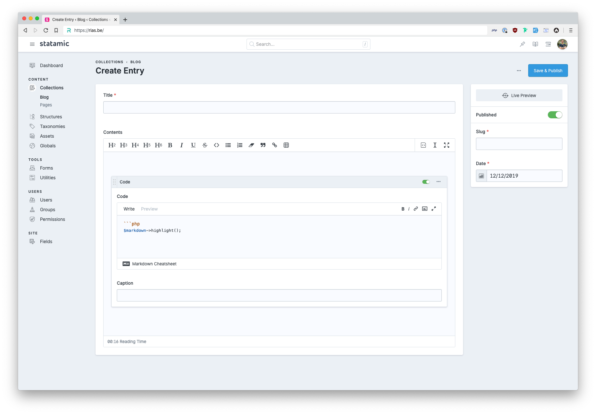

[](https://github.com/riasvdv/statamic-markdown-highlight/releases)

# Markdown Highlight

> Markdown Syntax Highlighting for Statamic 3.

This Addon provides pre-rendered syntax highlighting based on highlight.js, so no need for any extra JavaScript to get some color in your code samples!



## Installation

Require it using Composer.

```
composer require rias/statamic-markdown-highlight
```

## Using Markdown Highlight

## Fieldtype

Add the fieldtype to your fieldset.

```yaml
sections:
  main:
    display: Main
    fields:
      -
        handle: code
        field:
          type: markdown_highlight
          display: Code
```

For other options, this fieldtype extends the default [Statamic Markdown](https://statamic.dev/fieldtypes/markdown) fieldtype.

## Tag

Add the Markdown Highlight tag to your template, this will inline the correct syntax highlighting theme.

```twig
{{ highlight:css }}
```

The default theme is `github-gist`, you can find more [styles here](https://highlightjs.org/static/demo/) and define it with your tag.

```twig
{{ highlight:css style="darcula" }}
```

## Highlighting specific lines

Line numbers start at 1.

\`\`\`php - Don't highlight any lines  
\`\`\`php{4} - Highlight just line 4  
\`\`\`php{4-6} - Highlight the range of lines from 4 to 6 (inclusive)  
\`\`\`php{1,5} - Highlight just lines 1 and 5 on their own  
\`\`\`php{1-3,5} - Highlight 1 through 3 and then 5 on its own  
\`\`\`php{5,7,2-3} - The order of lines don't matter  

However, specifying 3-2 will not work.  

---
Brought to you by [Rias](https://rias.be)
